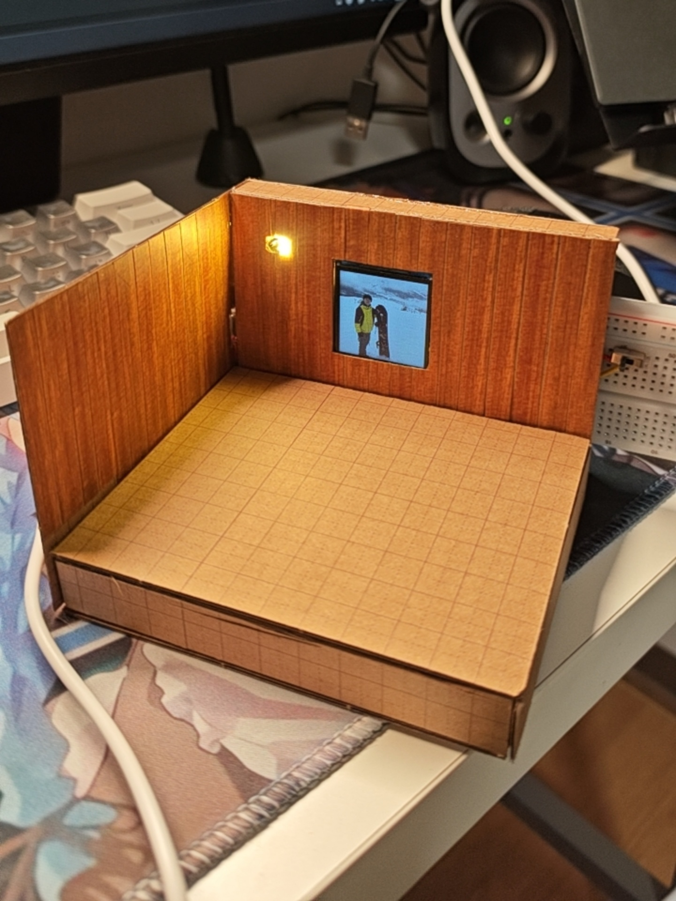
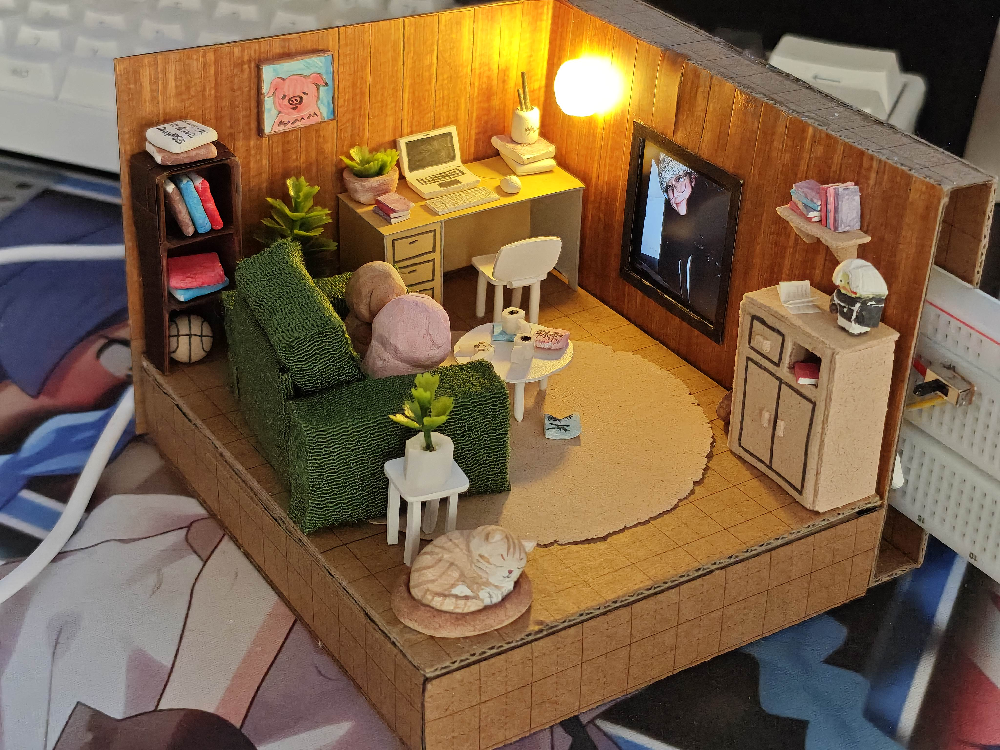

# ESP32-C3 Supermini ST7789 Slideshow (RGB666)

[English](readme.md) | [中文](README_zh.md) | [日本語](README_ja.md)

**以下の内容は翻訳によるものです。*

### はじめに
> 本プロジェクトは、ESP32-C3 SuperMini 開発ボード、ST7789 IPS 1.54インチ 240x240 ディスプレイ、および SD カードモジュールで構成されるデジタルフォトフレームプロジェクトです。1:12 スケールのミニチュアジオラマを作成するために開発されました。これは私にとって初めての組み込み開発の試みでした。知識ゼロの状態から、部品の選定から製作まで、Gemini の助けを借りて約3日でプロジェクトを完了させました。RGB666 で ST7789 を駆動するための情報がインターネット上に少なかったため、このプロジェクトを記録し、共有することにしました。

***注意: 本リポジトリのコードはすべて Gemini によって生成されました。***

ESP32-C3 の限られたリソース（特に連続メモリブロックの制限）のため、本プロジェクトは、「時間を空間に換える」戦略（チャンク読み取り）と「空間を速度に換える」戦略（DMA 転送）を組み合わせることで、ST7789 画面を正常に駆動しています。バイナリデータ（`.bin`）を直接読み取ることで、ST7789 駆動チップの 26万2千色の色彩表現力を物理的な限界まで引き出しています。

## プロジェクトの目的

- **物理的限界の色彩表示**: 一般的なグラフィックライブラリの RGB565（16ビットカラー）の制限を突破し、**RGB666（18ビットカラー、262,144色）** の物理的限界の色彩表示を実現します。
- **無劣化画質スライドショー**: 生のバイナリピクセルストリームを直接読み取ることで、画像圧縮による画質劣化を排除し、鮮明で繊細なデジタルフォトフレーム機能を実現します。
- **高性能リフレッシュ**: データ転送経路を最適化し、色深度の高い画像を再生する際にもスムーズな切り替え速度を維持します。

## プロジェクトの特長

- **「プロトコル・バイパス」ダイレクト駆動**: 従来のグラフィックライブラリの高レベル関数を放棄し、SPI バスを介して生の 24ビット（3バイト）ピクセルデータを直接駆動チップに送信し、真の 18ビットカラー表示を実現します。
- **スプリットバッファ DMA（Split-Buffer DMA）**: ESP32-C3 のメモリ断片化および連続 SRAM の不足（利用可能約 147KB）という課題に対処するため、画面を上下（240x120）に分割し、非同期 DMA 転送と組み合わせる戦略を採用し、メモリのオーバーヘッドと転送速度のバランスを取りました。
- **PC 側前処理メカニズム**: PC 側の Python スクリプトを使用して BMP 画像の RGB666 フォーマット変換を完了させ、ファイルヘッダーのない `.bin` 生データストリームを生成することで、マイクロコントローラー側のデコード負担を完全に排除しました。
- **SPI バスの効率的なマルチプレックス**: ピンが極端に不足している SuperMini 開発ボードにおいて、画面と SD カードで SCK と MOSI ラインを共有し、独立したチップセレクト（CS）ロジックを通じて2つの高速デバイスを精密に管理しています。

## プレビューと配線

本プロジェクトの実際の動作結果とハードウェア配線図は以下の通りです：

### デモ画像

### 完成品ギャラリー

### 画質比較
*(注：RGB666 と RGB565 の違いは、非常に暗い部分で最も顕著です。16ビットの RGB565 フォーマットは、暗部で緑がかったり明らかなカラーバンディング（階調の乱れ）が現れることが多いのに対し、18ビットの RGB666 は滑らかで正確な暗部の色調を完全に維持します。)*

### 配線表
| ボードピン (ESP32-C3) | 画面ピン (ST7789) | SDカードピン | 機能説明 |
| :--- | :--- | :--- | :--- |
| GPIO 2 | DC | - | データ/コマンド選択 |
| GPIO 3 | BL | - | バックライト制御 (PWM) |
| GPIO 4 | SCL | SCK | 共通 SPI クロック |
| GPIO 5 | - | MISO | SDカード データ受信 |
| GPIO 6 | SDA | MOSI | 共通 SPI データ送信 |
| GPIO 7 | CS | - | 画面チップセレクト |
| GPIO 10 | - | CS | SDカード チップセレクト |
| 3.3V | RES | - | 画面リセット (High固定) |
| 5V | VCC | VCC | 5V 電源入力 |
| GND | GND | GND | 共通グランド |

### 配線図

## ファイル概要

### 1. `convert565.py`
240x240 解像度の RGB888 BMP 画像を RGB565 フォーマットの `.bin` バイナリストリームに変換するためのグラフィカルインターフェースを提供する Python スクリプトです。各ピクセルを 3バイトに変換し、正確なビット単位のクリッピングを実行します。主に RGB565 と RGB666 をテストおよび比較するために使用されます。

### 2. `convert666.py`
**推奨。** 240x240 解像度の RGB888 BMP 画像を 18ビットの RGB666 フォーマットに変換するためのグラフィカルインターフェースを提供する Python スクリプトです。ビットシフト操作を通じてカラーデータを整列させ、最高の色再現性を追求し、18ビットの色深度サポートを必要とする ST7789 画面構成のために設計されています。

### 3. `esp.ino`
ESP32-C3 のコアとなる Arduino C++ ファームウェアであり、主に以下のタスクを担当します：
- SD カードのルートディレクトリにあるすべての bin ファイル画像を順番に再生します。
- ファイル名 `01.bin` から検索を開始し、順に `99.bin` まで増やします。途中で欠落しているファイルはスキップされます。
- SPI バスを介して ST7789 画面と SD カードを初期化します。
- DMA メモリ割り当てメカニズムを利用して、SD カードから直接、変換された `.bin` ファイルを効率的かつ高速に読み取ります。
- ノンブロッキングの連続的な画像読み取りと表示を実装し、比較的滑らかなデジタルフォトフレームのスライドショーを構成します。
- ハードウェア PWM を通じて画面のバックライトの明るさを調整します（デフォルトの明るさは約 30%）。
- プログラム内のピン宣言は上記の配線表を参照してください。

## 使い方 (How to use)

1. **Python スクリプト (`convert666.py`) を使用して、仕様を満たす画像（BMP フォーマット 24bit 240x240）を処理します。**
2. **生成された `.bin` ファイルの名前を `01.bin`, `02.bin`... に変更し、SD カードのルートディレクトリに保存します。**
3. **回路を接続し、コードを書き込み、電源を入れます。**
