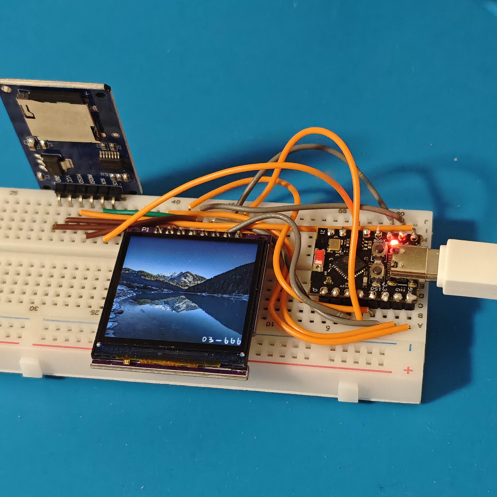
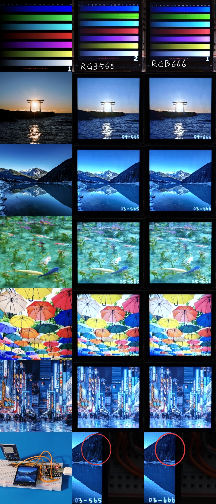
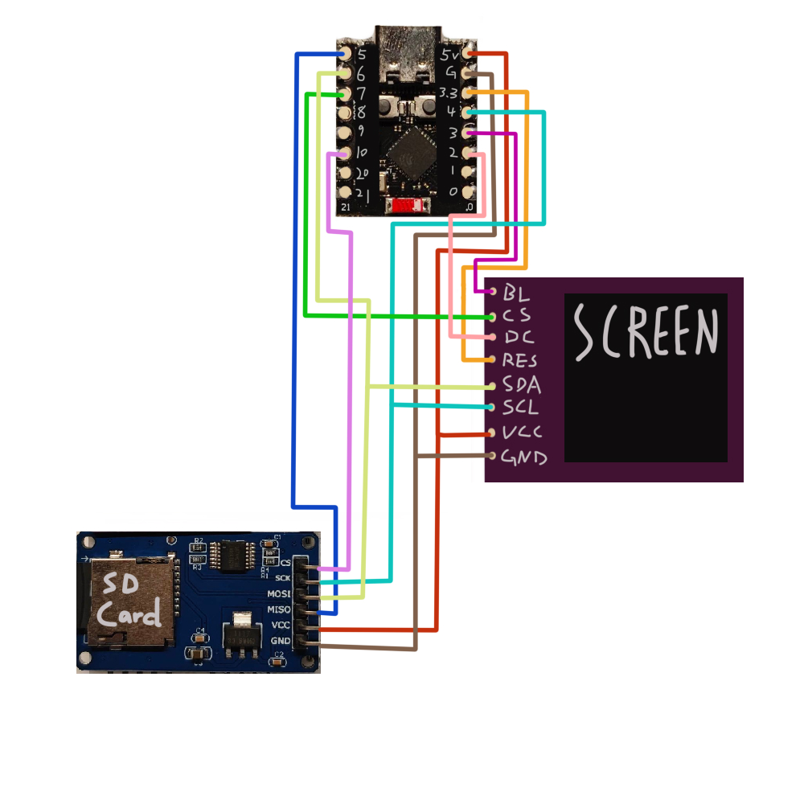

# ESP32-C3 SuperMini ST7789 Slideshow (RGB666)

[English](readme.md) | [中文](README_zh.md) | [日本語](README_ja.md)

### 前言
> 项目为一款基于ESP32-C3 supermini开发板和ST7789 IPS 1.54寸240*240屏幕及SD卡模块组成的电子相册项目，是为制作一份1：12的微缩场景模型而开发，是我第一次尝试入门嵌入式开发，从零基础直至完成该项目，从选材到制作，全程在gemini的帮助下用时3天左右完成。由于网上有关驱动RGB666的ST7789的资料较少，所以记录并分享下这个项目。

***注意：本仓库中的所有代码均由 Gemini 生成。***

由于 ESP32-C3 资源有限（特别是连续内存块的限制），该项目通过 **“以时间换空间”** （分块读取）与 **“以空间换速度”** （DMA 传输）相结合的策略，成功驱动了 ST7789 屏。通过直接读取二进制数据（`.bin`），将 ST7789 驱动芯片的 262K 色色彩表现力发挥到了极致。

## 项目实现目的

- **物理极限色彩显示**：突破常规图形库常用的 RGB565（16位色）限制，实现 **RGB666（18位色，262,144 色）** 的物理极限色彩显示。
- **无损画质轮播**：通过直接读取原始二进制像素流，消除图像压缩带来的画质损耗，实现清晰、细腻的电子相册功能。
- **高性能刷新**：优化数据传输路径，确保在播放高色深图片时依然能保持流畅的切换速度。

## 项目特色点

- **“协议越级”暴力直通**：放弃传统图形库的高层函数，通过 SPI 总线直接向驱动芯片发送原始的 24 位（3 字节）像素数据，实现真正的 18 位色显示。
- **双段 DMA 分块缓冲（Split-Buffer DMA）**：针对 ESP32-C3 内存碎片化及连续 SRAM 不足（约 147KB 可用）的挑战，采用将屏幕划分为上下两半（240x120）并配合 DMA 异步传输的策略，平衡了内存开销与传输速度。
- **PC 端预处理机制**：利用 Python 脚本在电脑端完成BMP 图片的RGB666 格式转换，生成无文件头的 `.bin` 原始数据流，彻底免去了单片机端的解码负担。
- **SPI 总线高效复用**：在引脚极度匮乏的 SuperMini 开发板上，实现了屏幕与 SD 卡共用 SCK 和 MOSI 线，通过独立的片选（CS）逻辑精细管理两个高速设备。

## 预览与硬件接线

以下是本项目的实际运行效果及硬件接线图展示：

### 演示图

### 画质对比
*(注：RGB666 和 RGB565 的差距在非常暗的暗部区域最为明显。16位的 RGB565 格式在暗部往往会出现发绿的现象或明显的色阶断层，而 18位的 RGB666 则完美保留了平滑、准确的暗部色调。)*

### 接线表
| 开发板引脚 (ESP32-C3) | 屏幕引脚 (ST7789) | SD卡模块引脚 | 功能描述 |
| :--- | :--- | :--- | :--- |
| GPIO 2 | DC | - | 数据/命令选择线  |
| GPIO 3 | BL | - | 背光控制 (PWM)  |
| GPIO 4 | SCL | SCK | 公共 SPI 时钟线  |
| GPIO 5 | - | MISO | SD卡数据回传线  |
| GPIO 6 | SDA | MOSI | 公共 SPI 数据输出线  |
| GPIO 7 | CS | - | 屏幕片选信号  |
| GPIO 10 | - | CS | SD卡片选信号  |
| 3.3V | RES | - | 屏幕复位 (固定高电平)  |
| 5V | VCC | VCC | 5V 供电输入  |
| GND | GND | GND | 公共地线  |

### 接线图

## 文件概览

### 1. `convert565.py`
提供图形界面的 Python 脚本，用于将 240x240 分辨率的 RGB888 BMP 图片转换为 RGB565 格式的 `.bin` 二进制流。该脚本将每个像素转换为 3 字节，并进行精确的位运算裁切，为测试RGB565与RGB666而使用。

### 2. `convert666.py`
**推荐使用**，提供图形界面的 Python 脚本，用于将 240x240 分辨率的 RGB888 BMP 图片转换为 18-bit RGB666 格式。通过位移操作对齐颜色数据，为追求最高色彩还原度、需 18-bit 色深支持的 ST7789 屏幕配置设计。

### 3. `esp.ino`
ESP32-C3 的核心 Arduino C++ 固件，主要负责以下任务：
- 轮流播放 SD 卡根目录下的所有bin文件图片。
- 搜索文件名称从01.bin开始，依次增加，直到99.bin。中间有文件缺失则跳过。
- 通过 SPI 总线初始化 ST7789 屏幕和 SD 卡。
- 借助 DMA 内存分配机制，从 SD 卡高效、快速地直接读取转换后的 `.bin` 文件。
- 实现非阻塞的图像连续读取与显示，构成较平滑的电子相册轮播功能。
- 通过硬件 PWM 调节屏幕背光亮度（默认亮度约30%）。
- 程序内引脚声明见上文接线表

## 如何使用 (How to use)

1. **用 Python 脚本(convert666.py)处理符合规格的图片（bmp格式24bit 240*240）**

2. **将生成的.bin 文件重命名为 01.bin, 02.bin...... 存入 SD 卡根目录**

3. **接好电路，烧录代码，通电**